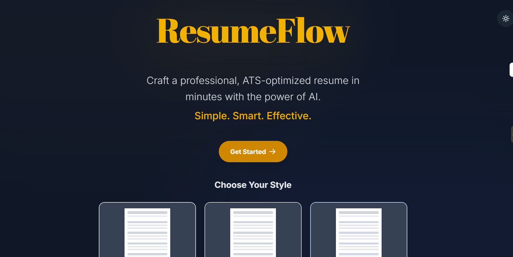

# ResumeFlow

An AI-powered CV generator that transforms your input into a refined, ATS-optimized resume with real-time LaTeX compilation and preview.



## 🌟 Features

- **AI-Powered Enhancement**: Automatically optimize your resume content for ATS (Applicant Tracking Systems) using Google Gemini AI
- **Real-time LaTeX Compilation**: Live preview of your resume as you type
- **Responsive Design**: Works seamlessly on desktop and mobile devices
- **Dark/Light Mode**: Toggle between themes with system preference detection
- **Custom Sections**: Add personalized sections beyond standard resume templates
- **Section Reordering**: Drag and rearrange resume sections as needed
- **Multiple Export Formats**: Download as PDF or LaTeX source code
- **Mobile-Friendly Interface**: Optimized experience across all devices

## 🚀 Tech Stack

### Frontend
- **React** (v18+) - UI framework
- **Vite** - Build tool and dev server
- **Tailwind CSS** - Styling framework
- **React-PDF** - PDF preview functionality

### Backend
- **Node.js** - Runtime environment
- **Express.js** - Web framework
- **Google Generative AI (Gemini)** - AI text enhancement
- **LaTeX (pdflatex)** - PDF generation

## 📋 Prerequisites

Before running this project, ensure you have the following installed:

- **Node.js** (v16.0 or higher)
- **npm** or **yarn** package manager
- **LaTeX distribution** (for PDF generation):
  - **Windows**: MiKTeX or TeX Live
  - **macOS**: MacTeX or TeX Live
  - **Linux**: TeX Live (`sudo apt-get install texlive-full` on Ubuntu)
- **Google AI API Key** (for AI enhancement features)

## 🛠️ Installation & Setup

### 1. Clone the Repository

```bash
git clone https://github.com/Saurabh-1785/ResumeFlow.git
cd ResumeFlow
```

### 2. Install Dependencies

Install root dependencies:
```bash
npm install
```

Install frontend dependencies:
```bash
cd frontend
npm install
cd ..
```

Install backend dependencies:
```bash
cd backend
npm install
cd ..
```

### 3. Environment Setup

Create a `.env` file in the `backend` directory:

```bash
cd backend
touch .env
```

Add the following environment variables to `backend/.env`:

```env
# Google AI API Configuration
GOOGLE_API_KEY=your_gemini_api_key_here

# Server Configuration
PORT=5000

# Optional: Set NODE_ENV for production
NODE_ENV=development
```

### 4. Get Google AI API Key

1. Go to [Google AI Studio](https://aistudio.google.com/app/apikey)
2. Sign in with your Google account
3. Create a new API key
4. Copy the API key and paste it in your `.env` file

### 5. Verify LaTeX Installation

Test if LaTeX is properly installed:

```bash
pdflatex --version
```

If command not found, install LaTeX:

**Ubuntu/Debian:**
```bash
sudo apt-get update
sudo apt-get install texlive-full
```

**macOS (with Homebrew):**
```bash
brew install --cask mactex
```

**Windows:**
- Download and install [MiKTeX](https://miktex.org/download)

## 🚀 Running the Application

### Development Mode

Run both frontend and backend concurrently:

```bash
npm run dev
```

This will start:
- Frontend development server: `http://localhost:5173`
- Backend API server: `http://localhost:5000`

### Individual Services

Run frontend only:
```bash
npm run frontend
```

Run backend only:
```bash
npm run backend
```

## 📱 Usage

1. **Start the Application**: Navigate to `http://localhost:5173`
2. **Fill Your Information**: 
   - General Info (name, contact, summary)
   - Education details
   - Work experience
   - Projects
   - Skills
   - Custom sections (optional)
3. **AI Enhancement**: Click "Enhance with AI" buttons to optimize content for ATS
4. **Real-time Preview**: See live LaTeX-compiled PDF preview (desktop only)
5. **Customize Layout**: Reorder sections in the "Section Order" tab
6. **Download**: Export as PDF or LaTeX source code

## 🎨 Customization

### Adding New Resume Templates

1. Modify `frontend/src/utils/generateLatex.js`
2. Update LaTeX template structure
3. Adjust styling and formatting

### Modifying AI Prompts

1. Edit the AI enhancement prompts in `backend/index.js`
2. Customize context-specific optimization rules
3. Adjust AI model parameters

### Theme Customization

1. Update Tailwind CSS configuration in `frontend/tailwind.config.js`
2. Modify color schemes in component files
3. Add new theme variants

## 📁 Project Structure

```
CV-Application/
├── frontend/                 # React frontend
│   ├── public/              # Static assets
│   ├── src/
│   │   ├── components/      # React components
│   │   │   ├── GeneralInfo.jsx
│   │   │   ├── Education.jsx
│   │   │   ├── Experience.jsx
│   │   │   ├── Projects.jsx
│   │   │   ├── Skills.jsx
│   │   │   ├── CustomSection.jsx
│   │   │   ├── Preview.jsx
│   │   │   ├── PdfPreview.jsx
│   │   │   ├── NavigationBar.jsx
│   │   │   └── SectionOrder.jsx
│   │   ├── utils/
│   │   │   └── generateLatex.js  # LaTeX generation logic
│   │   ├── App.jsx          # Main app component
│   │   └── main.jsx         # Entry point
│   ├── package.json
│   └── vite.config.js
├── backend/                 # Express backend
│   ├── index.js            # Server and API routes
│   ├── package.json
│   └── .env               # Environment variables
├── package.json           # Root package.json
└── README.md
```

## 🔧 API Endpoints

### POST `/generate-pdf`
- **Description**: Generates PDF from LaTeX content
- **Body**: `{ "tex": "LaTeX_content_string" }`
- **Response**: PDF file download

### POST `/enhance-text`
- **Description**: Enhances text using AI for ATS optimization
- **Body**: `{ "text": "content_to_enhance", "context": "section_context" }`
- **Response**: `{ "enhancedText": "optimized_content" }`

## ⚠️ Troubleshooting

### Common Issues

1. **LaTeX compilation errors**:
   - Ensure LaTeX is properly installed
   - Check if all required LaTeX packages are available
   - Try installing `texlive-full` for complete package set

2. **AI enhancement not working**:
   - Verify Google AI API key is correctly set in `.env`
   - Check internet connection
   - Ensure API key has proper permissions

3. **PDF preview not loading**:
   - Check browser console for errors
   - Ensure React-PDF dependencies are installed
   - Try refreshing the page

4. **Port conflicts**:
   - Change ports in `package.json` scripts if 5000 or 5173 are occupied
   - Update backend port in frontend API calls if changed

### Development Tips

- Use browser developer tools to debug frontend issues
- Check backend console logs for API errors
- Test LaTeX compilation manually with sample `.tex` files
- Monitor network tab for API request/response debugging

## 🤝 Contributing

1. Fork the repository
2. Create a feature branch: `git checkout -b feature-name`
3. Commit changes: `git commit -am 'Add new feature'`
4. Push to branch: `git push origin feature-name`
5. Submit a Pull Request


## 🙏 Acknowledgments

- Google Generative AI for text enhancement capabilities
- LaTeX community for excellent documentation
- React and Vite teams for amazing development tools
- Tailwind CSS for responsive design utilities

## 📞 Support

If you encounter any issues or have questions:

1. Check the [Issues](https://github.com/Saurabh-1785/ResumeFlow/issues) page
2. Create a new issue with detailed description
3. Include system information and error logs

---

**Made with ❤️ by [Saurabh](https://github.com/Saurabh-1785)**