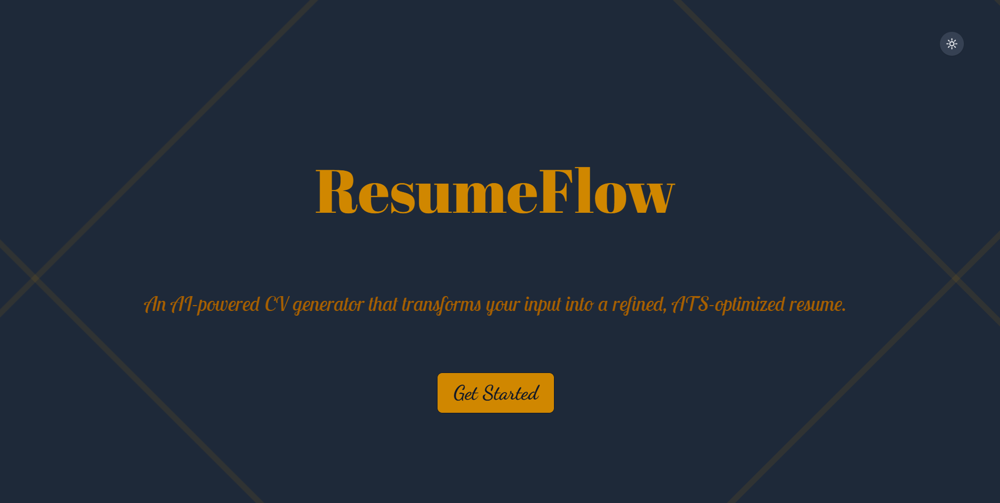

# ResumeFlow

An AI-powered CV generator that transforms your input into a refined, ATS-optimized resume with real-time LaTeX compilation and preview.



## 🌟 Features

- **AI-Powered Enhancement**: Automatically optimize your resume content for ATS (Applicant Tracking Systems) using Google Gemini 2.0 Flash.
- **Real-time LaTeX Compilation**: Server-side LaTeX compilation for professional-grade PDF output.
- **Responsive Mobile-First Design**: Seamless experience across desktop, tablet, and mobile devices.
- **Modern UI/UX**: 
  - **Custom Cursor**: sleek, interactive cursor for enhanced usability.
  - **Glassmorphism & Animations**: Premium visual aesthetics.
  - **Dark/Light Mode**: Automatic theme detection and toggling.
- **Custom Sections**: Add personalized sections beyond standard resume templates.
- **Section Reordering**: Easily rearrange resume sections to fit your narrative.
- **Multiple Templates**: Choose from different professional resume layouts.
- **Multiple Export Formats**: Download as PDF or LaTeX source code.

## 🚀 Tech Stack

### Frontend
- **React** (v19) - Latest UI library for building interactive interfaces.
- **Vite** - Next-generation frontend tooling.
- **Tailwind CSS** (v4) - Utility-first CSS framework for styling.
- **React-PDF** - For rendering PDF previews in the browser.
- **Framer Motion** (implied by animations) / **CSS Animations** - For smooth transitions.

### Backend
- **Node.js** & **Express.js** - Robust server-side runtime and framework.
- **Google Gemini API** (Gemini 2.0 Flash) - Advanced AI model for text optimization.
- **LaTeX (pdflatex)** - Professional typesetting system for generating high-quality PDFs.

## 📋 Prerequisites

Before running this project, ensure you have the following installed:

1.  **Node.js** (v18.0 or higher)
2.  **npm** (Node Package Manager)
3.  **LaTeX Distribution** (CRITICAL for PDF generation):
    *   **Windows**: [MiKTeX](https://miktex.org/download) or [TeX Live](https://www.tug.org/texlive/)
    *   **macOS**: [MacTeX](https://www.tug.org/mactex/) (`brew install --cask mactex`)
    *   **Linux**: TeX Live (`sudo apt-get install texlive-full`)
4.  **Google AI API Key**: Get one from [Google AI Studio](https://aistudio.google.com/app/apikey).

## 🛠️ Installation & Setup

### 1. Clone the Repository

```bash
git clone https://github.com/Saurabh-1785/ResumeFlow.git
cd ResumeFlow
```

### 2. Install Dependencies

Install dependencies for both frontend and backend from the root directory:

```bash
# Install root dependencies
npm install

# Install frontend dependencies
cd frontend
npm install
cd ..

# Install backend dependencies
cd backend
npm install
cd ..
```

### 3. Environment Configuration

Create a `.env` file in the `backend` directory:

```bash
cd backend
# Create .env file (Windows PowerShell)
New-Item -Path .env -ItemType File
# OR (Bash)
touch .env
```

Open `backend/.env` and add your configuration:

```env
# Google AI API Configuration
GOOGLE_API_KEY=your_actual_gemini_api_key_here

# Server Configuration
PORT=5000
```

### 4. Verify LaTeX Installation

Ensure `pdflatex` is accessible from your terminal:

```bash
pdflatex --version
```

If this command fails, please install a LaTeX distribution (see Prerequisites).

## 🚀 Running the Application

You can run both the frontend and backend concurrently with a single command from the **root** directory:

```bash
npm run dev
```

This will start:
- **Frontend**: http://localhost:5173
- **Backend**: http://localhost:5000

### Running Services Individually

If you prefer to run them in separate terminals:

**Frontend:**
```bash
cd frontend
npm run dev
```

**Backend:**
```bash
cd backend
npm start
```

## 📱 Usage Guide

1.  **Fill Details**: Enter your personal info, education, experience, and skills.
2.  **AI Enhance**: Click the "Enhance with AI" button next to text fields to optimize your content for ATS using Gemini 2.0.
3.  **Customize**:
    - Use the **Section Order** tab to drag and drop sections.
    - Toggle **Dark/Light** mode for your preferred viewing experience.
4.  **Preview**: The PDF preview updates automatically (on desktop).
5.  **Download**: Click "Download PDF" to get your resume.

## ⚠️ Troubleshooting

### PDF Generation Fails
*   **Issue**: "Error generating PDF" or 500 error.
*   **Fix**: Ensure `pdflatex` is installed and added to your system's PATH. Restart your terminal/IDE after installing LaTeX.

### AI Enhancement Not Working
*   **Issue**: "Error from AI service".
*   **Fix**: Check your `GOOGLE_API_KEY` in `backend/.env`. Ensure it has active quota.

### Styles Looking Wrong?
*   **Fix**: Ensure you are using a modern browser. The project uses Tailwind CSS v4 features.

## 🤝 Contributing

Contributions are welcome! Please feel free to submit a Pull Request.

---

**Made with ❤️ by [Saurabh](https://github.com/Saurabh-1785)**